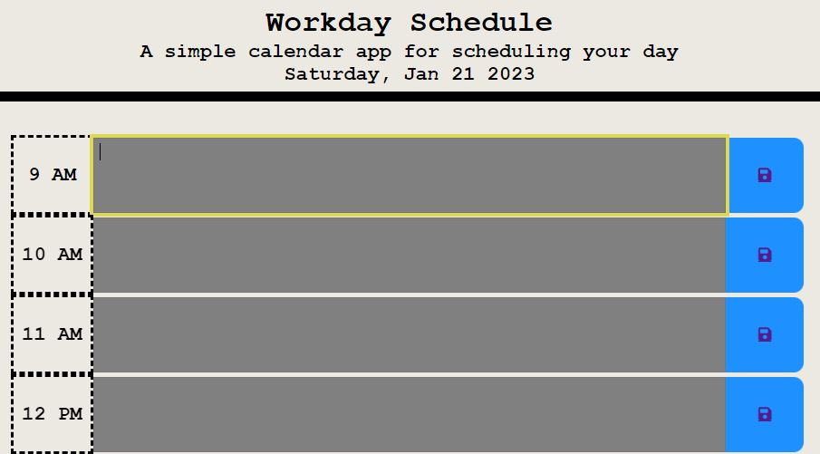

# handyWorkdaySchedule

## Description

This handy workday schedule tracker is an application that stores your important events for the day. It rewrites the authors previous events at the click of a save button. It runs in the browser and features dynamically updated HTML and CSS powered by Javascript code. If the user is unsure what day it is they may reference the date presented in the page's header. Additionally, colored time blocks indicate what time of day it is within a typical work period. Users need not worry about losing their events as this data is uploaded into the browsers localstorage and persist upon refresh.

### Third Party APIs:

- Leveraging Localstorage to save data
- Passing stringified data with JSON
- Returning and parsing storage
- Calling Day.js to display the current time
- Setting color indicators based on current time

## Table of Contents (Optional)

- [Installation](#installation)
- [Usage](#usage)
- [Badges](#badges)
- [How_to_Contribute](#how_to_contribute)
- [Credits](#credits)
- [License](#license)

## Installation

No installation needed.

## Usage

The website can be found at: https://arishorts.github.io/handyworkdayschedule/

The user can enter an event when they click into a time block. Once desired, the user can save by clicking the save button for that time block 

## Badges

 
 

## How_to_Contribute

If you would like to contribute, refer to the [Contributor Covenant](https://www.contributor-covenant.org/)

## Credits

- Mosh Hamedani: https://codewithmosh.com/
- Jquery Tutorial (Udemy): https://www.udemy.com/course/jquery-tutorial/learn/lecture/4968932#notes
- DayJS API : https://day.js.org/en/

## License

MIT License https://choosealicense.com/licenses/mit/

---

© 2022 Ariel Schwartz LLC. Confidential and Proprietary. All Rights Reserved.
